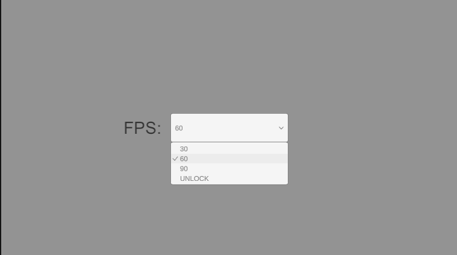
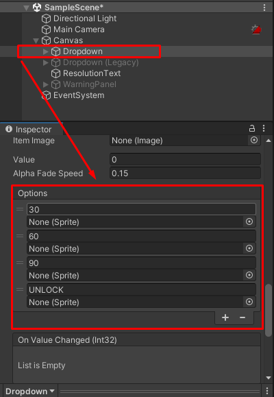

# FPS Selector for Unity

👋 ¡Hola, desarrolladores de Unity! Soy KaitoArtz, y estoy emocionado de compartir este proyecto contigo.

🚀 **¿Quieres estar al día con mis próximos proyectos de Unity?** ¡Sígueme en mis redes sociales!

- [](https://x.com/K41t0M)
- [](https://www.instagram.com/kaitoartzz/#)
- [](https://linkedin.com/in/TuPerfil)
- [](https://app.daily.dev/kaitoartz)

No te pierdas mis futuros proyectos que ayudarán a tus proyectos en Unity.

---

Este repositorio contiene un script de C# diseñado para Unity (versión 2021.3.15f1 o superior) que permite a los desarrolladores seleccionar y ajustar el framerate (FPS) de su juego de manera sencilla. Con este script, puedes ofrecer a los jugadores la opción de cambiar entre diferentes configuraciones de FPS a través de un menú desplegable en la UI.



*Vista del script FPS Selector en game de Unity*

## Características
- **Selección de FPS**: Los jugadores pueden elegir entre 30, 60, 120 FPS o desbloquear el FPS.
- **Integración Sencilla**: Fácil de integrar en cualquier proyecto de Unity.
- **Persistencia de Configuración**: La selección de FPS se guarda y se aplica automáticamente en futuras sesiones del juego.

## Instalación

1. **Descargar el Script**: Clona este repositorio o descarga el archivo `FPSSelector.cs`.
2. **Importar a Unity**: Coloca el archivo `FPSSelector.cs` en la carpeta `Scripts` de tu proyecto de Unity.
3. **Agregar el Script a un GameObject**:
   - Crea un nuevo `GameObject` vacío en tu escena o utiliza uno existente.
   - Arrastra el script `FPSSelector` al `GameObject`.
4. **Configurar el Dropdown en la UI**:
   - En tu escena, añade un componente `TMP_Dropdown` a la UI.
   - En el inspector, asigna el `TMP_Dropdown` al campo `fpsDropdown` en el script `FPSSelector`.

## Configuración en el Inspector

Para que el script funcione correctamente, asegúrate de configurar los siguientes valores en el Inspector:



*Configuración necesaria para el FPS Selector en el Inspector de Unity*

1. **FPS Dropdown**: Asigna aquí tu TMP_Dropdown de la UI.
2. **Selected FPS**: Este valor se actualizará automáticamente según la selección del usuario.
3. **Default FPS**: Establece el FPS por defecto (por ejemplo, 60).
4. **Save Key**: Nombre de la clave para guardar la configuración de FPS (por ejemplo, "SelectedFPS").

## Uso

1. **Configuración Inicial**:
   - Al iniciar el juego, el script cargará la última configuración de FPS seleccionada.
   - El dropdown se ajustará automáticamente al valor correspondiente.

2. **Cambio de FPS**:
   - Los jugadores pueden seleccionar un valor diferente en el dropdown.
   - Para aplicar la nueva configuración de FPS, llama al método `ApplyFPSSetting()` desde el script.

## Personalización y Uso Avanzado

### Modificar las opciones de FPS disponibles

Puedes cambiar las opciones de FPS disponibles modificando los métodos `GetFPSFromDropdownIndex` y `GetDropdownIndexFromFPS`. Por ejemplo, si quieres añadir una opción de 90 FPS:

```csharp
public int GetFPSFromDropdownIndex(int index)
{
    switch (index)
    {
        case 0: return 30;
        case 1: return 60;
        case 2: return 90;  // Nueva opción de 90 FPS
        case 3: return 120;
        case 4: return 0; // Unlock FPS
        default: return 60;
    }
}

public int GetDropdownIndexFromFPS(int fps)
{
    switch (fps)
    {
        case 30: return 0;
        case 60: return 1;
        case 90: return 2;  // Nueva opción de 90 FPS
        case 120: return 3;
        case 0: return 4; // Unlock FPS
        default: return 1; // Default to 60 FPS
    }
}
```

Recuerda actualizar también las opciones en tu `TMP_Dropdown` en la UI de Unity para que coincidan con estos cambios.

### Aplicar FPS automáticamente al cambiar el dropdown

Si quieres que el FPS se aplique inmediatamente al cambiar el dropdown, puedes modificar el método `DropdownValueChanged`:

```csharp
public void DropdownValueChanged(TMP_Dropdown change)
{
    selectedFPS = GetFPSFromDropdownIndex(change.value);
    ApplyFPSSetting(); // Aplica el FPS inmediatamente
}
```

### Añadir un evento de cambio de FPS

Si quieres notificar a otras partes de tu juego cuando cambia el FPS, puedes añadir un evento:

```csharp
public delegate void FPSChangedDelegate(int newFPS);
public event FPSChangedDelegate OnFPSChanged;

public void ApplyFPSSetting()
{
    SetFPS(selectedFPS);
    OnFPSChanged?.Invoke(selectedFPS); // Invoca el evento
}
```

Luego, en otros scripts, puedes suscribirte a este evento:

```csharp
void Start()
{
    FPSSelector fpsSelector = FindObjectOfType<FPSSelector>();
    fpsSelector.OnFPSChanged += HandleFPSChanged;
}

void HandleFPSChanged(int newFPS)
{
    Debug.Log($"FPS changed to: {newFPS}");
    // Realiza acciones basadas en el nuevo FPS
}
```

### Guardar y cargar configuraciones personalizadas

Puedes extender la funcionalidad para guardar configuraciones personalizadas:

```csharp
public void SaveCustomFPSSetting(string settingName, int fps)
{
    PlayerPrefs.SetInt($"CustomFPS_{settingName}", fps);
}

public int LoadCustomFPSSetting(string settingName)
{
    return PlayerPrefs.GetInt($"CustomFPS_{settingName}", 60); // Default to 60 if not found
}
```

Estas modificaciones te permiten adaptar el script FPSSelector a las necesidades específicas de tu proyecto.

## Requisitos

- Unity 2021.3.15f1 o superior.
- `TextMeshPro` debe estar instalado en tu proyecto para usar `TMP_Dropdown`.

## Contribuciones

¡Las contribuciones son bienvenidas! Si tienes mejoras, ideas, o encuentras un bug, siéntete libre de abrir un issue o enviar un pull request.

## Licencia

Este proyecto está licenciado bajo la Licencia MIT. Consulta el archivo [Licencia](LICENSE.md) para más detalles.

## Políticas de Privacidad

Este proyecto no recopila información personal ni técnica de los usuarios. Para más detalles, consulta nuestras [Políticas de Privacidad](SECURITY.md).
