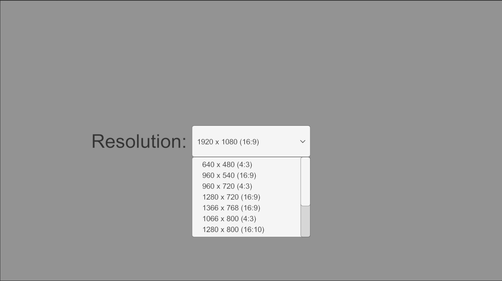
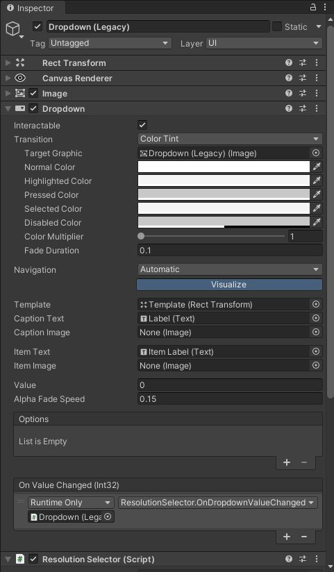
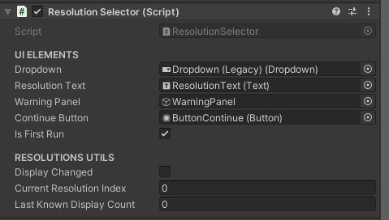

# Resolution Selector for Unity

✨🌷 ¡Hola, pequeños devs!💖 Soy KaitoArtz, y estoy emocionado de compartir este proyecto contigo.

‼🥺 **¿Quieres estar al día con mis próximos proyectos de Unity?** ¡Sígueme en mis redes sociales!

- [](https://x.com/K41t0M)
- [](https://www.instagram.com/kaitoartzz/#)
- [](https://linkedin.com/in/TuPerfil)
- [](https://app.daily.dev/kaitoartz)

No te pierdas mis futuros proyectos que ayudarán a mejorar tus proyectos en Unity.

---

Este repositorio contiene un script de C# diseñado para Unity (versión 2021.3.15f1 o superior) que permite a los desarrolladores agregar un selector de resolución a través de un menú desplegable (`Dropdown`) en la UI de Unity. Este script es ideal para proyectos que necesitan adaptarse a diferentes resoluciones de pantalla, incluyendo opciones específicas para Steam Deck y plataformas de escritorio.



*Vista del script Resolution Selector en el inspector de Unity*

## Características

- **Selector de Resolución**: Permite a los jugadores seleccionar entre múltiples resoluciones compatibles.
- **Detección Automática de Cambios**: El script detecta automáticamente cambios en las pantallas conectadas y actualiza las opciones disponibles.
- **Integración Sencilla**: Fácil de agregar y configurar en cualquier proyecto de Unity.
- **Persistencia de Configuración**: La selección de resolución se guarda y se aplica automáticamente en futuras sesiones del juego.

## Instalación

1. **Descargar el Script**: Clona este repositorio o descarga el archivo `ResolutionSelector.cs`.
2. **Importar a Unity**: Coloca el archivo `ResolutionSelector.cs` en la carpeta `Scripts` de tu proyecto de Unity.
3. **Agregar el Script a un GameObject**:
   - Crea un nuevo `GameObject` vacío en tu escena o utiliza uno existente.
   - Arrastra el script `ResolutionSelector` al `GameObject`.
4. **Configurar el Dropdown en la UI**:
   - En tu escena, añade un componente `Dropdown` (legacy) a la UI.
   - Asigna el `Dropdown` al campo `dropdown` en el script `ResolutionSelector`.
   - En el elemento `Dropdown` del inspector, al campo `On Value Changed (int32)` de valor `Runtime Only` arrastra el script `ResolutionSelector` y selecciona `ResolutionSelector` -> `OnDropdownValueChanged`

Para que el dropdown funcione, asegúrate de configurar los siguientes valores en el Inspector:



## Configuración en el Inspector

Para que el script funcione correctamente, asegúrate de configurar los siguientes valores en el Inspector:



*Configuración necesaria para el Resolution Selector en el Inspector de Unity*

1. **Dropdown**: Asigna aquí tu `Dropdown` (legacy) de la UI.
2. **Warning Panel**: Asigna un panel de advertencia que se muestre cuando se detecte un cambio en las pantallas conectadas.
3. **Continue Button**: Asigna el botón que oculta el panel de advertencia y actualiza la configuración de resolución.
4. **Resolution Text**: Asigna un `Text` para mostrar la resolución seleccionada.

## Resoluciones Disponibles

El script incluye diferentes listas de resoluciones para diversas plataformas, incluyendo Steam Deck y sistemas de escritorio (Windows, macOS, Linux). Puedes habilitar o modificar estas listas según tus necesidades:

### Resoluciones para Steam Deck

Si deseas usar resoluciones específicas para Steam Deck, puedes activar la siguiente lista en el script:

```csharp
private Resolution[] supportedResolutions = new Resolution[] {
    new Resolution() { width = 640, height = 480 },  //(4:3)
    new Resolution() { width = 960, height = 720 },  //(4:3)
    new Resolution() { width = 1280, height = 720 },
    new Resolution() { width = 1066, height = 800 }, //(4:3)
    new Resolution() { width = 1280, height = 800 },
    new Resolution() { width = 1440, height = 1080 }, //(4:3)
    new Resolution() { width = 1920, height = 1080 }
};
```
## Resoluciones para Escritorio (Windows, macOS, Linux)

Para configuraciones más amplias en sistemas de escritorio, puedes usar esta lista de resoluciones:

```csharp
private Resolution[] supportedResolutions = new Resolution[] {
    new Resolution() { width = 640, height = 480 },
    new Resolution() { width = 960, height = 540 },
    new Resolution() { width = 960, height = 720 },
    new Resolution() { width = 1280, height = 720 },
    new Resolution() { width = 1366, height = 768 },
    new Resolution() { width = 1066, height = 800 },
    new Resolution() { width = 1280, height = 800 },
    new Resolution() { width = 1440, height = 900 },
    new Resolution() { width = 1440, height = 1080 },
    new Resolution() { width = 1920, height = 1080 },
    new Resolution() { width = 2560, height = 1080 },
    new Resolution() { width = 2880, height = 2160 },
    new Resolution() { width = 3840, height = 2160 }
};
```

Puedes modificar estas listas para adaptarlas a otras plataformas o necesidades específicas.

## Uso

1. **Configuración Inicial:**

Al iniciar el juego, el script cargará la última configuración de resolución seleccionada.
El dropdown se ajustará automáticamente al valor correspondiente.

2. **Cambio de Resolución:**
   
Los jugadores pueden seleccionar una resolución diferente en el dropdown.
Para aplicar la nueva configuración de resolución, el script automáticamente ajustará la resolución de pantalla.

3. **Detección Automática de Cambios de Pantalla:**
   
El script verifica periódicamente si hay cambios en la configuración de pantallas conectadas (como al conectar o desconectar monitores) y actualiza las opciones disponibles en el dropdown.

## Personalización y Uso Avanzado

1. **Modificar las Resoluciones Disponibles**

Puedes cambiar las opciones de resolución disponibles modificando el array`[]` `supportedResolutions` en el script:

```csharp
private Resolution[] supportedResolutions = new Resolution[] {
    new Resolution() { width = 640, height = 480 },
    new Resolution() { width = 960, height = 540 },
    new Resolution() { width = 1280, height = 720 },
    new Resolution() { width = 1920, height = 1080 },
    new Resolution() { width = 3840, height = 2160 }
};
```

2. **Añadir Más Funcionalidades**

Si deseas agregar más funcionalidades, como un evento que se dispare al cambiar la resolución, puedes hacerlo así:

```csharp
public delegate void ResolutionChangedDelegate(Resolution newResolution);
public event ResolutionChangedDelegate OnResolutionChanged;

public void SetResolution(int width, int height)
{
    Screen.SetResolution(width, height, Screen.fullScreen);
    OnResolutionChanged?.Invoke(new Resolution() { width = width, height = height });
}
```

Luego, puedes suscribirte a este evento en otros scripts de tu proyecto para realizar acciones basadas en la nueva resolución.

## Requisitos

- Unity 2021.3.15f1 o superior.
- Se requiere el uso del `Dropdown Legacy` en el Canvas de Unity.

## Contribuciones

¡Las contribuciones son bienvenidas! Si tienes mejoras, ideas, o encuentras un bug, siéntete libre de abrir un issue o enviar un pull request.

## Licencia

Este proyecto está licenciado bajo la Licencia MIT. Consulta el archivo [Licencia](LICENSE.md) para más detalles.

## Políticas de Privacidad

Este proyecto no recopila información personal ni técnica de los usuarios. Para más detalles, consulta nuestras [Políticas de Privacidad](SECURITY.md).
